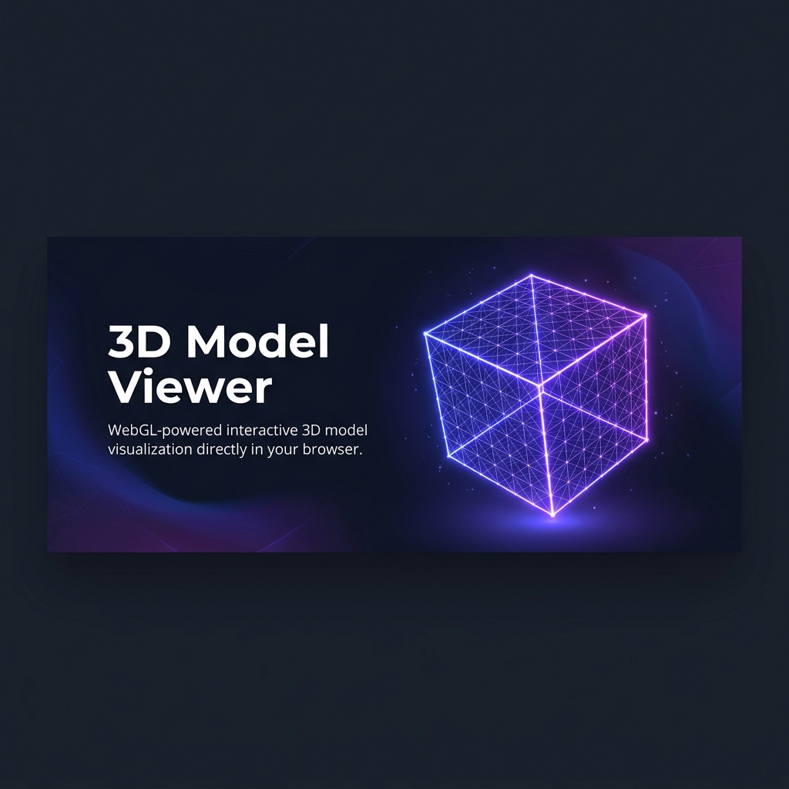
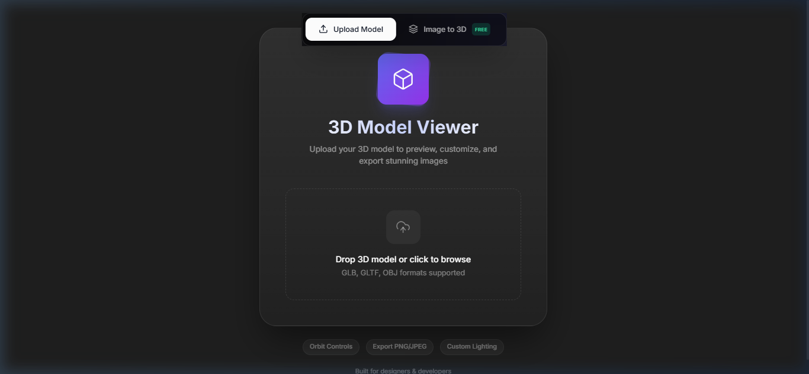

<p align="center">
  
</p>

<h1 align="center">🧊 3D Model Viewer</h1>

<p align="center">
  <strong>A professional-grade, browser-based 3D model viewer with Figma-inspired UI</strong>
</p>

<p align="center">
  <a href="#features">Features</a> •
  <a href="#demo">Demo</a> •
  <a href="#quick-start">Quick Start</a> •
  <a href="#tech-stack">Tech Stack</a> •
  <a href="#architecture">Architecture</a> •
  <a href="#usage-guide">Usage Guide</a> •
  <a href="#keyboard-shortcuts">Shortcuts</a> •
  <a href="#contributing">Contributing</a>
</p>

<p align="center">
  
  
  
  
  
</p>

---

## ✨ Overview

**3D Model Viewer** is a feature-rich, client-side web application for uploading, previewing, customizing, and exporting 3D models — all within a polished, Figma-inspired workspace. It supports **GLB**, **GLTF**, and **OBJ** formats, plus a unique **Image-to-3D** depth generator that converts any 2D image into a 3D mesh using client-side depth estimation.

No backend required. No API keys. Everything runs locally in your browser.

<p align="center">
  
</p>

---

## 🎯 Features

### 🖼️ Model Management
- **Drag & Drop Upload** — Drop `.glb`, `.gltf`, or `.obj` files directly onto the canvas
- **Image to 3D** — Convert any 2D image (JPG/PNG/WebP) into a depth-based 3D mesh, completely free and client-side
- **GLB Export** — Export your customized model as a `.glb` file

### 🎨 Material Editing
- **Click-to-Select Materials** — Click any part of the model to select its material
- **Per-Material Color Editing** — Change individual material colors with a color picker
- **Whole-Model Coloring** — Apply a single custom color to the entire model
- **Visual Selection Outline** — Selected parts get a highlighted edge outline (EdgesGeometry)
- **Reset Colors** — One-click reset to original material colors

### 💡 Advanced Lighting System
| Feature | Description |
|---------|-------------|
| **Lighting Presets** | Soft, Studio, and Dramatic preset configurations |
| **Intensity Control** | Global lighting intensity slider (0.1x – 2.0x) |
| **Exposure** | Tone mapping exposure control (0.5 – 3.0) |
| **Color Temperature** | Warm ↔ Cool temperature slider with visual tint (-100 to +100) |
| **Environment Maps** | 6 procedural gradient environments (None, Studio, Sunset, Dawn, Night, Warehouse) |
| **Rim Light** | Configurable back-light with color picker and intensity |
| **Spot Light** | Focused spotlight with angle, softness, orbital position (0–360°), and height |
| **Bloom / Glow** | Real-time post-processing bloom via UnrealBloomPass (intensity, threshold, radius) |

### 🌑 Shadow System
- **Drop Shadow** — Configurable opacity, color, blur, and offset
- **Contact Shadow** — Radial gradient-based contact shadow at model base
- **Inner Shadow** — AO-based inner shadow simulation
- **Per-Light Shadow Maps** — 4096×4096 PCF soft shadow maps

### 🖥️ Scene Controls
- **Orbit Camera** — Smooth damped orbit with zoom and pan
- **Transform Tools** — Grab (translate), Rotate, and Scale with Three.js TransformControls
- **Camera Presets** — Front, Top, and Isometric quick views
- **Wireframe Mode** — Toggle wireframe rendering
- **Grid Overlay** — Optional reference grid
- **Background** — Custom color picker or transparent background mode

### 📸 Export
- **High-Res Image Export** — PNG or JPEG at 1K, 2K, or 4K resolution
- **Aspect Ratios** — 1:1, 4:3, and 16:9 presets
- **GLB Model Export** — Save the scene as a binary GLTF file
- **Clean Export** — Automatically hides grids, outlines, and UI during capture

### ↩️ Undo / Redo
- Full undo/redo history for settings and material color changes
- Keyboard shortcuts: `Ctrl+Z` / `Ctrl+Shift+Z`

### 📱 Fully Responsive
- **Desktop** (1280px+) — Full sidebar panel
- **Tablet** (768–1024px) — Narrower panel, compact controls
- **Mobile** (< 768px) — Bottom drawer panel with toggle button
- **Landscape Mobile** — Adaptive toolbar and compact header
- **Touch Optimized** — Larger touch targets on `pointer: coarse` devices
- **Accessibility** — `prefers-reduced-motion` support

---

## 🚀 Quick Start

### Prerequisites
- **Node.js** ≥ 18
- **npm** ≥ 9

### Installation

```bash
# Clone the repository
git clone https://github.com/subhashana00/3d-model-viewer.git
cd 3d-model-viewer

# Install dependencies
npm install

# Start development server
npm run dev
```

The app will be available at `http://localhost:3000`

### Build for Production

```bash
npm run build
npm run preview
```

---

## 🛠️ Tech Stack

| Layer | Technology | Purpose |
|-------|-----------|---------|
| **Framework** | React 18.3 | Component-based UI with hooks |
| **3D Engine** | Three.js 0.162 | WebGL rendering, scene graph, materials |
| **Language** | TypeScript 5.4 | Type-safe codebase |
| **Bundler** | Vite 5.4 | Fast HMR development and optimized builds |
| **Styling** | Tailwind CSS 3.4 + Vanilla CSS | Utility classes + custom design system |
| **Post-Processing** | Three.js EffectComposer | Bloom/glow via UnrealBloomPass |
| **3D Loaders** | GLTFLoader, OBJLoader | Multi-format model support |
| **3D Export** | GLTFExporter | Binary GLB model export |
| **Depth Gen** | Canvas API | Client-side depth map estimation |

---

## 🏗️ Architecture

```
src/
├── App.tsx                      # Root — state orchestration, undo/redo, settings
├── main.tsx                     # React entry point
├── index.css                    # Full design system + responsive breakpoints
│
├── components/
│   ├── layout/
│   │   ├── Header.tsx           # Top bar — logo, undo/redo, replace model
│   │   └── ModeSwitch.tsx       # Upload / Image-to-3D tab switcher
│   │
│   ├── upload/
│   │   ├── UploadCard.tsx       # 3D model drag & drop upload
│   │   └── ImageUploadCard.tsx  # Image upload for depth-to-3D conversion
│   │
│   └── viewer/
│       ├── Viewer.tsx           # Three.js scene — rendering, lighting, materials
│       ├── ControlsPanel.tsx    # Right sidebar — all settings UI
│       ├── Toolbar.tsx          # Left toolbar — transform mode tools
│       ├── StatusBar.tsx        # Bottom bar — model info, transform mode
│       ├── ExportButton.tsx     # Floating export button with dropdown
│       └── ModelInfoPanel.tsx   # Model metadata display
│
├── constants/
│   └── lighting.ts              # Lighting preset configurations
│
├── types/
│   └── index.ts                 # TypeScript interfaces & types
│
└── utils/
    ├── model-loader.ts          # GLB/GLTF/OBJ file loading & camera positioning
    ├── depth-generator.ts       # 2D image → depth map → 3D mesh pipeline
    └── history.ts               # Generic undo/redo history manager
```

### Data Flow

```
┌─────────────┐     settings      ┌──────────────┐
│   App.tsx    │ ────────────────► │  Viewer.tsx   │
│  (State Hub) │ ◄──── controls ── │  (Three.js)   │
│             │                   └──────────────┘
│             │     settings
│             │ ────────────────► ┌──────────────────┐
│             │ ◄── onChange ──── │ ControlsPanel.tsx │
│             │                   └──────────────────┘
│             │
│             │ ──── onReady ──► ViewerControls API
│             │     (resetCamera, exportImage, setMaterialColor, etc.)
└─────────────┘
```

---

## 📖 Usage Guide

### Upload a 3D Model
1. Open the app at `http://localhost:3000`
2. **Drag and drop** a `.glb`, `.gltf`, or `.obj` file onto the upload area — or click to browse
3. The model loads into the 3D viewport with default Studio lighting

### Image to 3D (Depth Mode)
1. Click the **"Image to 3D"** tab in the top center
2. Upload any **JPG, PNG, or WebP** image (max 10MB)
3. Adjust depth settings: **Strength**, **Resolution**, **Smoothness**, **Thickness**
4. Click **"Generate 3D Model"** to create a depth-based 3D mesh
5. Export as **GLB** from the export menu

### Transform the Model
| Tool | Action | Shortcut |
|------|--------|----------|
| 🖱️ Orbit | Rotate camera around model | Left-click drag |
| ✋ Grab | Move model position | `G` key |
| 🔄 Rotate | Rotate model orientation | `R` key |
| 📐 Scale | Resize model | `S` key |
| 🎯 Reset | Reset model transforms | Toolbar button |

### Edit Materials
1. **Click on any part** of the 3D model to select it
2. The selected part highlights with a blue edge outline
3. In the **Materials** section of the right panel, the clicked material is highlighted
4. Use the **color picker** to change the material's color
5. Click **"Reset Colors"** to restore originals

### Customize Lighting
1. Open the **Lighting** section in the right panel
2. Choose a **Preset** (Soft / Studio / Dramatic)
3. Adjust **Exposure** and **Color Temperature** sliders
4. Enable **Rim Light** for back-edge highlighting
5. Enable **Spot Light** and orbit its position around the model
6. Enable **Bloom** for post-processing glow effects
7. Choose an **Environment** preset for ambient reflections

### Export
- Click the **purple Export button** (bottom-right)
- Choose **"Export Image"** → select resolution (1K/2K/4K), format (PNG/JPEG), aspect ratio
- Choose **"Export 3D Model"** → downloads as `.glb`

---

## ⌨️ Keyboard Shortcuts

| Shortcut | Action |
|----------|--------|
| `Ctrl + Z` | Undo |
| `Ctrl + Shift + Z` | Redo |
| `G` | Grab (translate) mode |
| `R` | Rotate mode |
| `S` | Scale mode |
| `Escape` | Return to orbit mode |
| `Scroll` | Zoom in/out |
| `Middle-click drag` | Pan camera |

---

## 📱 Responsive Breakpoints

| Breakpoint | Target | Panel Behavior |
|-----------|--------|----------------|
| `≤ 480px` | Small phones | Compact header, hidden labels, minimal UI |
| `≤ 767px` | Mobile | Bottom drawer panel with toggle button |
| `768–1024px` | Tablet | 230px sidebar, compact prop labels |
| `1024–1280px` | Small desktop | 245px sidebar |
| `1280px+` | Desktop | 260px sidebar (default) |
| `1600px+` | Ultra-wide | 290px wider sidebar |
| `≤500px height` | Landscape mobile | Horizontal toolbar, compact sidebar |

---

## 🧩 Key Technical Details

### Three.js Pipeline
- **Renderer**: WebGL with ACES Filmic tone mapping, PCF soft shadow maps, sRGB color space
- **Post-Processing**: `EffectComposer` → `RenderPass` → `UnrealBloomPass` → `OutputPass`
- **Shadow Maps**: 4096×4096 resolution with configurable bias and blur radius
- **Environment Maps**: Procedural gradient spheres rendered via `PMREMGenerator`
- **Raycasting**: Click detection using `THREE.Raycaster` for material selection
- **Selection Outline**: `EdgesGeometry` + `LineBasicMaterial` for selected mesh highlighting

### State Management
- Centralized in `App.tsx` using React `useState` hooks
- `HistoryManager` utility provides generic undo/redo with configurable max depth
- Settings and material colors are snapshotted together for atomic undo/redo

### Performance Considerations
- `devicePixelRatio` is capped at 2x to balance quality and performance
- Bloom composer is only active when bloom is enabled (conditional render path)
- Environment maps are generated once per preset change via `PMREMGenerator`
- Shadow maps use `PCFSoftShadowMap` for quality/performance balance
- Model traversal is minimized — only triggered on setting changes

---

## 📂 Configuration Files

| File | Purpose |
|------|---------|
| `vite.config.ts` | Vite build config with React plugin and `@/` path alias |
| `tsconfig.json` | TypeScript config with strict mode and path mapping |
| `tailwind.config.js` | Custom screens, colors, animations, and keyframes |
| `postcss.config.js` | PostCSS with Tailwind and Autoprefixer plugins |

---

## 🤝 Contributing

1. **Fork** the repository
2. **Create** a feature branch: `git checkout -b feature/my-feature`
3. **Commit** your changes: `git commit -m 'Add my feature'`
4. **Push** to the branch: `git push origin feature/my-feature`
5. **Open** a Pull Request

### Development Guidelines
- Use TypeScript for all new code
- Follow existing component patterns (functional components with hooks)
- Add new settings to `SceneSettings` type in `src/types/index.ts`
- Add new UI controls to `ControlsPanel.tsx` using `PanelSection` and `PropRow` components
- Add new Three.js logic to `Viewer.tsx` as `useEffect` hooks with appropriate dependencies

---

## 📄 License

This project is open source and available under the [MIT License](LICENSE).

---

<p align="center">
  <strong>Built with ❤️ for designers & developers</strong>
</p>

<p align="center">
  <sub>React • Three.js • TypeScript • Vite</sub>
</p>
